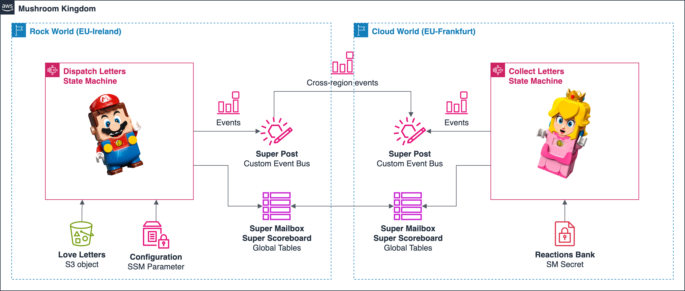

# Super Mario Love Letters

Sample functionless application running with help of AWS services like EventBridge, Step Functions, DynamoDB, and without Lambda.

## Overview

**Story:** Mario sends love letters to Pricess Peach using Super Post. 

State machine in primary region (Mario) is triggered manually by a custom event. The workflow loads JSON file from S3 bucket (love letters), creates ASL map out of JSON array and stars a map run. Each execution adds records to DynamoDB global tables (Mailbox, Scoreboard) and generates an event. As last step all events are collected as an array and send out to secondary bus.

State machine in secondary region (Princess Peach) is triggered by incoming events (letters from Mario). Each document is validated (if status is new and if it's a love letter). Each execution updates records in DynamoDB global tables (mailbox, scoreboard). As last step of each execution an event is sent to local bus for storing the result in dedicated log group.

## Diagram



## Components

This CDK application deploys 3 CDK stacks in 2 regions:

- SharedResourcesStack (primary region)
- SuperPostPrimaryStack (primary region)
- SuperPostSecondaryStack (secondary region)

Application consists of the following AWS resources:

- DynamoDB global tables
- Step Functions state machines
- EventBridge event buses
- EventBridge event rules
- SSM Parameter Store parameters
- Secrets Manager secret
- CloudWatch log groups
- CloudWatch dashboard
- S3 bucket

## Context

Modify the `cdk.context.json` file to change deployment regions:

```json
{
  "regions": {
    "primary": "eu-west-1",
    "secondary": "eu-central-1"
  }
}
```

## Start Engine

To start execution of state machines generate a custom EventBridge event in primary region:

```
{
  "source": "SuperPost",
  "detail-type": "ImportLetters",
  "detail": {}
}
```

Alternatively, use the following script (defined in package.json):

```
npm run event
```

## Useful commands

* `npm install`           installs all required NPM packages
* `npm run build`         compiles TypeScript to JavaScript
* `cdk synth --all`       emits the synthesized CloudFormation templates
* `cdk deploy --all`      deploys all stacks to your default AWS account
* `npm run event`         sends custom event to start automation
* `cdk destroy --all`     destroys all stacks from your AWS account
